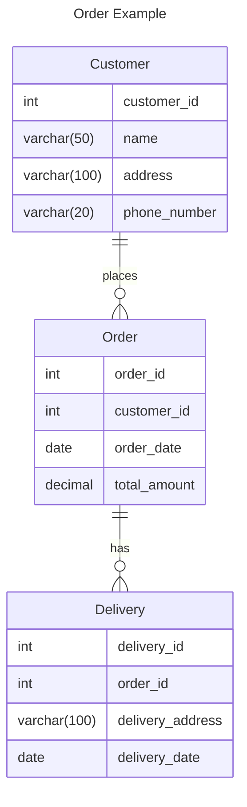

# Concepts of databases:

## 1. Data and Organization:

### Data:

    Databases store information, or data, about a specific real-world subject. This data can be anything from text and numbers to images and multimedia.

### Organization:

    Unlike a messy pile of papers, databases organize data in a structured way. Imagine a filing cabinet with folders and labeled sections - that's the essence of database organization.

## 2. Building Blocks:

### Database:

    The big picture - the entire collection of information organized electronically. Think of it as the whole filing cabinet.

### Tables:

     These are like the folders in your filing cabinet. Each table stores data about a specific category of information. For example, you might have a "Customers" table and an "Orders" table.

### Columns:

     Imagine the drawers within each folder. Columns define the type of data stored in each compartment. A "Customers" table might have columns for "Customer ID," "Name," "Address," and "Phone Number."

### Rows:

    These are like the individual files within a drawer. Each row represents a single instance of data related to the table. For example, one row in the "Customers" table might hold information about a specific customer, like John Smith.

## 3. Keys and Relationships:

### Primary Key:

    This is a unique identifier for each row in a table. It's like a label on a file that ensures you can find it easily. There can only be one primary key per table.

### Foreign Key:

    This column in one table creates a link to another table's primary key. Imagine a note on a file referencing another folder - it helps connect related data across tables. For example, an "Orders" table might have a "Customer ID" foreign key that links it to the "Customers" table, showing who placed the order.

## 4. Data Manipulation (CRUD):

    CRUD stands for Create, Read, Update, and Delete. These are the fundamental operations you can perform on data in a database.

### Create:

    Adding new data (rows) to a table.

### Read:

    Retrieving existing data from a table. This is often done using queries, which are like specific instructions for finding the data you need.

### Update:

    Modifying existing data in a table.

### Delete:

    Removing data from a table.

## 5. Database Management Systems (DBMS):

    A DBMS is the software that allows you to create, manage, and interact with databases. It's like a program that helps you organize and access all the information stored in your filing cabinet. There are many popular DBMS options like MySQL, Oracle, and Microsoft SQL Server.

## 6. Role in data management:

In data management, databases play a central role in organizing, storing, retrieving, and manipulating data.They act like the filing cabinets of the digital world, but with superpowers! Here's how databases contribute to effective data management.

### Structured Storage:

Unlike scattered files and folders, databases organize data in a structured way using tables, columns, and rows. This makes it easier to find specific information quickly and efficiently. Imagine finding a customer's address in a well-organized filing cabinet compared to a messy pile of papers!

### Data Integrity:

Databases enforce data integrity, which means ensuring data accuracy and consistency. They have rules to prevent duplicate entries and incorrect formats. This is like having a filing system that checks for typos and ensures you don't accidentally file the same document twice.

### Scalability:

Databases can handle massive amounts of data, growing as your information needs increase. This is crucial as businesses collect more data over time. Imagine your filing cabinet magically expanding to accommodate all your new information!

### Data Sharing and Access Control:

Databases allow controlled access to data by authorized users. Different user roles might have varying levels of access, ensuring data security and privacy. This is like having a filing cabinet with designated drawers for different departments, each with its own key.

### Data Analysis and Reporting:

Databases are a foundation for data analysis. They can be queried (like asking specific questions) to extract valuable insights and generate reports. This is like using your filing cabinet to find specific data points to understand trends in your business.

### Data Backup and Recovery:

Databases have mechanisms for backing up data and recovering it in case of system failures. This ensures your information is safe and recoverable in case of unexpected events. Imagine having a backup copy of your filing cabinet documents stored securely in case of a fire!

## 7. Different types of DBMS

There are two main types of DBMS: Relational (SQL) and Non-Relational (NoSQL):

### i. Relational Databases (SQL):

#### Structure:

    Data is organized in tables with rows and columns, like a spreadsheet.

#### Relationships:

    Tables are linked together using predefined relationships based on a shared field (often with a primary/foreign key connection). Imagine filing cabinets with linked folders based on a specific category.

#### Schema:

    Data has a predefined structure (schema) that dictates data types and relationships. Think of it as a filing system with designated sections for specific types of documents.

#### SQL Queries:

     Structured Query Language (SQL) is used to interact with the database, retrieve data, and perform updates. It's like having a specific language for searching and managing your filing cabinet.

#### Strengths:

     Ideal for structured data, complex queries involving multiple tables, data integrity, and maintaining consistency.

#### Weaknesses:

    Less flexible for unstructured data, scaling can be challenging for massive datasets, and complex SQL queries can require specialized skills.

### ii. NoSQL Databases (Non-Relational):

#### Structure:

Data can be stored in various formats like documents (JSON), key-value pairs, graphs, or wide-column stores. Imagine a filing cabinet that can hold different types of documents, not just paper.

#### Relationships:

Relationships may be implicit or defined differently based on the data model. Think of it as a filing system where connections between documents might be based on tags or keywords, not a strict hierarchy.

#### Schema:

Schema can be flexible or even schema-less, allowing for diverse data types and structures. Imagine a filing system that can adapt to new types of documents without needing a complete overhaul.

#### Languages:

NoSQL databases use various query languages or APIs specific to the data model. There's no single language like SQL for NoSQL databases.

#### Strengths:

Highly scalable for massive datasets, flexible for unstructured and diverse data types, often simpler to set up and manage.

#### Weaknesses:

May not be suitable for complex queries involving multiple data points across different structures, data consistency can be a concern in some models.

Choosing between SQL and NoSQL depends on your specific data needs and priorities. Here's a simple analogy:

> Think of SQL databases as a well-organized library with a strict filing system for books.

> Think of NoSQL databases as a flexible archive that can store various types of information, not just books.

## 7. Key funactinality of DBMS

Database Management Systems (DBMS) are software applications that act as intermediaries between users and databases. They provide a structured way to:
Create, manage, and interact with databases. Imagine a DBMS as the librarian of a vast library, helping you manage the organization and access of information.

Here are some key functionalities of a DBMS:

### Data Definition:

A DBMS allows you to define the structure of a database, including creating tables, specifying data types for each column (like text, numbers, dates), and establishing relationships between tables. This is like designing the blueprint for your library, including designated sections and how books within those sections are categorized.

### Data Manipulation:

     A DBMS facilitates adding, updating, deleting, and retrieving data from the database.  This includes functionalities like inserting new data (like adding new books to the library), modifying existing information (updating book details), and searching for specific data (finding books by title or author).

### Data Security:

    A DBMS enforces access control mechanisms to ensure data privacy and integrity. It allows you to define user permissions, restricting who can access or modify specific data.  This is like having a security system in the library that controls who can access certain sections or borrow books.

### Data Backup and Recovery:

    A DBMS provides tools for backing up your data regularly and recovering it in case of system failures or accidental data loss.  This is like having a backup system for the library's valuable books in case of emergencies.

### Query Processing:

     A DBMS allows users to query the database using languages like SQL (Structured Query Language).  SQL is like a specific language you can use to ask the library questions and retrieve the information you need.  For instance, you could ask for a list of all books by a particular author or books published after a certain date.

### Concurrency Control:

    When multiple users access the same data simultaneously, a DBMS manages this concurrency to prevent conflicts and ensure data consistency. This is like having a system in the library that ensures no two people try to check out the same book at the same time.
